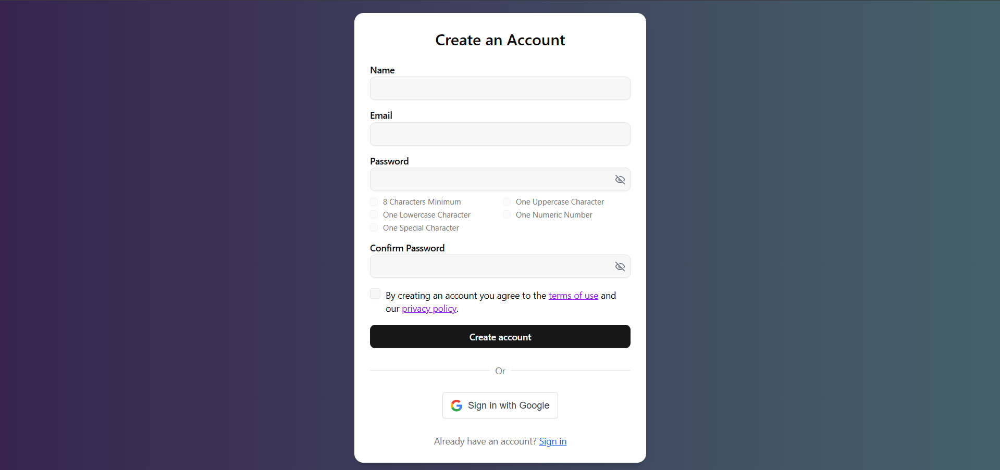
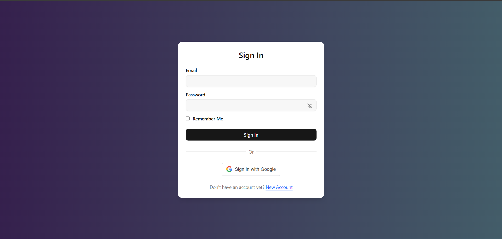
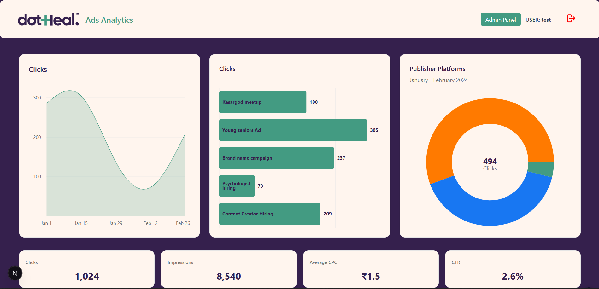
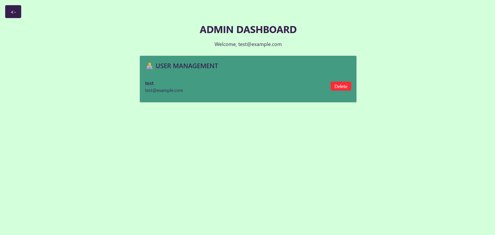

# analytics-dash

A fullstack web application for tracking and managing analytics across platforms. Built using **Next.js**, **FastAPI**, **PostgreSQL**, and **JWT authentication** with support for Google login.

---

## 🔐 Authentication

The app supports:

- Manual Sign Up / Login
- Google OAuth Login
- JWT-based access and refresh tokens
- Email verification for new users

---

## 📸 Screenshots

### 📝 Sign Up


---

### 🔐 Sign In


---

### 📊 Dashboard


---

### 🛠️ Admin Panel


---

## ⚙️ Tech Stack

**Frontend**
- Next.js
- Tailwind CSS
- Google OAuth

**Backend**
- FastAPI
- PostgreSQL
- SQLAlchemy
- JWT Auth
- CORS + OAuth2 + Secure cookies

---

## 🌐 Deployment

- **Frontend**: Vercel (`https://adsdash.vercel.app`)
- **Backend**: Render (`https://analytics-dash-x9fd.onrender.com`)

---

## 🛠️ Development Setup

### Backend
```bash
cd backend
python -m venv env
source env/bin/activate
pip install -r requirements.txt
uvicorn app.main:app --reload
